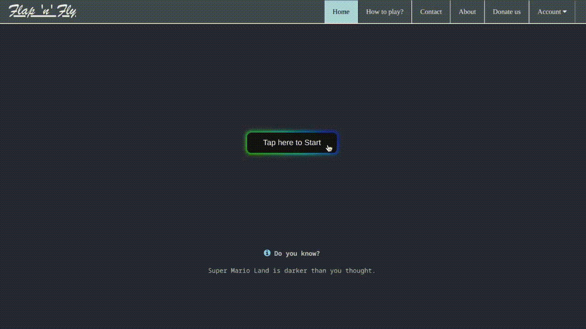

# Flap-n-Fly

## Introduction

Flap-n-Fly is a simple game inspired by the popular mobile game Flappy Bird. The game is written in HTML, CSS and JavaScript and can be played in any modern web browser.

## Installation

You don't need to install anything to play this game. Just visit the [Flap-n-Fly Website](https://flapnfly.netlify.app/) to start playing.

## Gameplay

The goal of the game is to navigate a bird through a series of pipes without colliding with them. The bird automatically moves forward and the player must tap the space bar to make the bird flap its wings and go up. The game ends if the bird collides with a pipe or if it falls off the screen.

## Controls

The controls for Flap-n-Fly are very simple:

- Space bar: Flap wings and go up

## Contributing

If you would like to contribute to this project, please feel free to fork the repository and submit a pull request. All contributions are welcome!

## Acknowledgments

- Created with the help of [W3Schools](https://w3schools.com/).
- Created as a part of my coursework in the first year of my degree.

## License

This project is licensed under the MIT License - see the [LICENSE](LICENSE) file for details.
